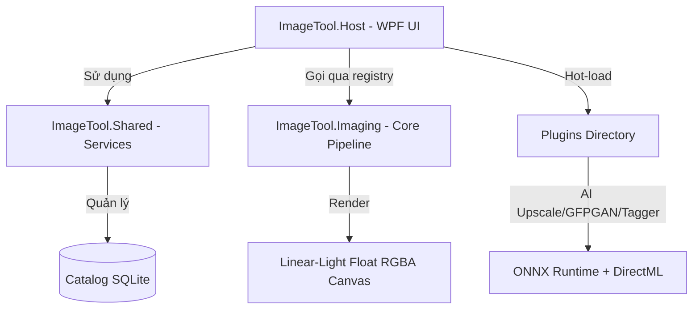

# 🌟 Aurora Studio

[](https://github.com/kzxl/AIImageTool/actions/workflows/build-test.yml)
[](LICENSE)


> **Aurora Studio** là một ứng dụng Desktop (WPF, .NET 8) hiện đại chuyên dùng để quản lý, xử lý và nâng cấp hình ảnh. Ứng dụng kết hợp sức mạnh của **quy trình chỉnh sửa ảnh phi phá hủy (non-destructive)** chất lượng cao (tương tự Adobe Lightroom, Darktable) với các **công cụ AI tiên tiến** (Upscale siêu phân giải, khôi phục khuôn mặt, tự động gán thẻ thông minh).

---


---

## ✨ Điểm nổi bật & Tính năng chính

### 🎨 1. Quy trình phát triển ảnh (Develop) phi phá hủy ở Linear Light
Toàn bộ các bộ lọc và thuật toán chỉnh sửa ảnh được áp dụng trực tiếp trong không gian màu tuyến tính (**linear light** với float RGBA) thông qua một Pipeline thông minh, giúp giữ lại tối đa chi tiết vùng sáng/tối mà không làm bệt màu.

*   **Tone & Ánh sáng**:
    *   **Exposure, Contrast, Highlights, Shadows, Whites, Blacks**.
    *   **Tone Curve & Parametric Curve** kéo điểm tự do hỗ trợ các preset mặc định (*Linear, Medium, Strong, Faded*).
    *   **Filmic, Filmic RGB, Sigmoid, Tone Equalizer, Dehaze**.
    *   **Levels** (chỉnh trên từng kênh, **Auto Levels**, **Auto Color** khử ám vàng/xanh).
    *   Hỗ trợ kéo và điều chỉnh tone trực tiếp trên biểu đồ **Histogram**.
*   **Màu sắc (Color)**:
    *   **White Balance** (chỉnh nhiệt độ màu Kelvin, **Auto WB**, công cụ chấm màu **eyedropper** và các preset nguồn sáng tiêu chuẩn).
    *   **HSL 8 dải màu** chi tiết + **Targeted Adjustment Tool (TAT)** (click kéo chuột trực tiếp trên ảnh để điều chỉnh HSL nhanh chóng).
    *   **Color Balance RGB 4-way** và vòng tròn màu **Color Grading**.
    *   **Split Toning, Channel Mixer, Selective Color, Color Unify, Velvia, Color Contrast (Lab)**.
    *   Hỗ trợ **3D LUT (.cube)** và profile màu đầu vào (**sRGB, AdobeRGB, Rec2020, Display P3**).
    *   **Black & White**: Trộn kênh chuyên sâu, áp dụng bộ lọc màu cổ điển và tông màu giả lập.
    *   **Film Negative (negadoctor)**: Hỗ trợ xử lý ảnh scan phim âm bản một cách chuyên nghiệp.
*   **Chi tiết & Sắc nét (Detail)**:
    *   **Sharpen** (hỗ trợ bán kính và **Masking** tìm kiếm cạnh biên thông minh).
    *   Khử nhiễu **Noise Reduction** (Luminance, Color, Chroma).
    *   Bộ lọc khuếch tán sắc nét **Diffuse-or-sharpen (PDE)**, loại bỏ **Hot Pixel**, sửa sắc sai (**CA Correct**, **Defringe**).
    *   **Texture, Clarity, Grain** (hiệu ứng hạt phim đen trắng và hạt màu).
*   **Hình học & Bố cục (Geometry)**:
    *   **Crop** tự do hoặc chọn theo tỉ lệ chuẩn (1:1, 16:9, 4:3...) cùng các lưới hướng dẫn bố cục.
    *   **Straighten, Rotate, Flip**, tự động xoay ảnh dựa trên dữ liệu **EXIF**.
    *   **Perspective / Upright** sửa méo hình học, **Liquify/Warp** kéo nắn ảnh bằng handle trực quan.
    *   **Lens Correction**: Tự động sửa méo và tối góc theo ống kính nhờ thư viện **lensfun** tích hợp dữ liệu EXIF hoặc chỉnh thủ công.
*   **Chỉnh sửa cục bộ (Local Adjustments)**:
    *   Tạo các vùng chọn bằng mặt nạ: **Gradient, Radial, Brush, Polygon, Luminance & Color Range, Parametric, AI Subject & AI Sky**.
    *   Kết hợp nhiều mặt nạ, điều chỉnh opacity và chế độ hòa trộn (blend modes).
    *   Sao chép/nhân bản mặt nạ dễ dàng; mỗi mặt nạ sở hữu đầy đủ bộ slider chỉnh sửa độc lập.
    *   Phím tắt `O` chuyển màu overlay nét cọ (**Mask Overlay Color**) xoay vòng Đỏ/Xanh lá/Xanh dương/Trắng/Đen giúp vẽ dễ nhìn.
*   **Preset & Quản lý Style**:
    *   Lưu các bước chỉnh sửa thành Style để áp dụng hàng loạt (chọn lọc các module cần áp dụng).
    *   **Hover Preset Preview**: Rê chuột qua Style ở cột trái để xem trước tức thì kết quả trên preview mà không ảnh hưởng tới history.
    *   **Import preset Lightroom (.xmp)**, tự động ghi file XMP sidecar để lưu trữ chỉnh sửa.
    *   **Named Snapshots**: Lưu nhiều phiên bản/mốc chỉnh sửa khác nhau trong cùng một ảnh để so sánh nhanh.

### 🗂️ 2. Quản lý thư viện ảnh & Catalog thông minh
*   Duyệt ảnh qua cấu trúc thư mục dạng cây và lưới thumbnail trực quan, thanh filmstrip cuộn nhanh.
*   **Compare View**: So sánh Before/After song song (Phím Y) hỗ trợ **Link Zoom & Link Pan** đồng bộ thu phóng và dịch chuyển bám sát vị trí con trỏ chuột.
*   Đánh giá ảnh nhanh bằng **Rating (1-5 sao), Flag (Pick/Reject/None), Color Label**. Phím tắt `B` thêm nhanh vào **Quick Collection**.
*   **Catalog SQLite** hiệu năng cao:
    *   Tự động lưu trữ thông tin ảnh.
    *   **Smart Collections**: Tự động gom nhóm ảnh dựa trên bộ quy tắc động (ví dụ: tất cả ảnh chụp bằng ống kính 50mm có rating >= 4 sao).
    *   Tìm kiếm nâng cao theo Camera, Lens, ISO, Khẩu độ, Tiêu cự, Ngày chụp.
    *   Từ khóa phân cấp (**Hierarchical Keywords**) cùng bảng gợi ý từ khóa thông dụng.
    *   **Stacking**: Gom nhóm các ảnh tương tự hoặc chụp liên tiếp để tránh rối mắt.

### ℹ️ 3. Panel Thông tin Tích hợp (Info Panel)
*   **Biểu đồ Histogram** thời gian thực (RGB/Luma) cùng chế độ cảnh báo cháy sáng (clipping overlay).
*   **Thông số chụp chi tiết (EXIF)**: Camera, Lens, Tiêu cự, Khẩu độ (f/), Tốc độ màn trập, ISO.
*   **Bảng màu K-Means**: Phân tích và trích xuất bảng màu chủ đạo của bức ảnh (hỗ trợ click để copy mã màu HEX nhanh).
*   **Bản đồ GPS**: Đọc dữ liệu tọa độ ảnh và hỗ trợ click mở trực tiếp trên bản đồ trực tuyến.
*   Chỉnh sửa siêu dữ liệu EXIF trực tiếp (Description, Artist, Copyright, Make/Model...) và quản lý keyword dạng tag chip.

### 📤 4. Bộ xuất ảnh chuyên nghiệp (Export Engine)
*   Hỗ trợ xuất các định dạng **JPEG, PNG, WebP, TIFF** (8-bit hoặc 16-bit chất lượng cao).
*   Thay đổi kích thước linh hoạt (theo %, chiều dài tối đa của cạnh) và áp dụng **Sharpen-for-output** tối ưu độ nét khi đăng web/in ấn.
*   Watermark bản quyền dạng ảnh hoặc chữ.
*   Đặt tên file tự động bằng token thông minh (ví dụ: `{name}_{date}_{n:000}`).
*   Xử lý xuất ảnh hàng loạt (batch export) chạy đa luồng song song không gây treo UI.
*   Giữ nguyên hoặc loại bỏ siêu dữ liệu EXIF/GPS/IPTC tùy cấu hình.
*   Ngăn chặn ghi đè tệp tin ngầm (tự động thêm hậu tố để tránh mất dữ liệu).

### 🤖 5. Tiện ích AI tích hợp (AI Plugins)
Ứng dụng hỗ trợ cơ chế nạp động và cô lập plugin an toàn:
*   **AssemblyLoadContext Isolation**: Tải mỗi plugin bằng một `PluginAssemblyLoadContext` riêng biệt và tự động phân giải các dependencies cục bộ bằng `AssemblyDependencyResolver` từ file `.deps.json`. Ngăn chặn hoàn toàn xung đột DLL giữa các plugin và hỗ trợ dọn dẹp bộ nhớ (Unload context) một cách an toàn.
*   **AI Upscaler**: Sử dụng mô hình **4x-UltraSharpV2 (ONNX)** với kỹ thuật **Tiled Inference** (chia nhỏ vùng xử lý để tiết kiệm VRAM) chạy qua DirectML trên GPU (NVIDIA, AMD, Intel) hoặc CPU fallback.
*   **Face Restorer**: Tích hợp mô hình **GFPGAN (ONNX)** giúp khôi phục chi tiết khuôn mặt bị mờ, nhòe khi chụp thiếu sáng hoặc phóng to.
*   **Vision Tagger**: Tự động phân tích nội dung hình ảnh bằng mô hình **WD ViT** để gán nhãn/từ khóa mô tả, lưu trực tiếp vào siêu dữ liệu của ảnh.

---

## 🛠️ Kiến trúc hệ thống & Công nghệ sử dụng

Ứng dụng được thiết kế theo hướng module hóa cao, tách biệt luồng UI và luồng xử lý ảnh nặng:



### Chi tiết các project thành phần
| Project | Vai trò / Công nghệ |
| :--- | :--- |
| **`ImageTool.Core`** | Interface, Models dùng chung cho toàn bộ hệ thống (Workspace, History, Catalog, Styles...). |
| **`ImageTool.Imaging`** | Lõi xử lý ảnh phi phá hủy chạy ở không gian tuyến tính (**linear light float RGBA**). Quản lý danh sách ~40 phép hiệu chỉnh ảnh (`IEditOp`), pipeline lưu trữ đệm tối ưu hóa render (`CachedEditPipeline`). |
| **`ImageTool.Shared`** | Dịch vụ nền: Catalog SQLite (sử dụng **LiteSql ORM** tối ưu), History, Stacking, Batch Export, EXIF/GPS parser, filename token engine. |
| **`ImageTool.Host`** | Lớp giao diện người dùng chính (WPF, MVVM). Chứa các chế độ xem linh hoạt (Single, Grid, Cull, Compare), histogram tương tác kéo thả trực tiếp, các bảng trượt điều khiển mượt mà. |
| **`Plugins`** | Các module AI chạy độc lập (`FaceRestorer`, `Upscaler`, `VisionTagger`) được load động lúc khởi động. |

---

## 💻 Yêu cầu hệ thống

*   **Hệ điều hành**: Windows 10 / 11 (64-bit).
*   **Môi trường chạy (với bản Lite)**: Đã cài đặt [.NET 8 Desktop Runtime](https://dotnet.microsoft.com/download/dotnet/8.0).
*   **Thành phần bắt buộc**: [Visual C++ 2015-2022 Redistributable (x64)](https://aka.ms/vs/17/release/vc_redist.x64.exe) để chạy các thư viện AI native.
*   **Phần cứng khuyên dùng**: GPU tương thích **DirectML** (NVIDIA GeForce, AMD Radeon, Intel Arc/UHD Graphics) để tăng tốc độ chạy các mô hình AI.

---

## 🚀 Hướng dẫn cài đặt & Chạy ứng dụng

Tải phiên bản mới nhất tại mục [Releases](../../releases):
*   **Bản Full (`AuroraStudio_Full_Win_x64.zip`)**: Đã đóng gói sẵn mọi thư viện phụ thuộc và .NET Runtime. Chỉ cần giải nén và chạy ngay file `AuroraStudio.exe`.
*   **Bản Lite (`AuroraStudio_Lite_Win_x64.zip`)**: Bản rút gọn nhẹ hơn dành cho máy đã cài đặt sẵn .NET 8 Runtime.

---

## 👩‍💻 Dành cho nhà phát triển

Nếu bạn muốn đóng góp code hoặc tự build ứng dụng từ mã nguồn:

### Chuẩn bị môi trường
1. Cài đặt [.NET 8 SDK](https://dotnet.microsoft.com/download/dotnet/8.0).
2. Cài đặt Visual Studio 2022 hoặc Rider hỗ trợ .NET 8.
3. Cài đặt C++ compiler (nếu muốn biên dịch lại các module native).

### Build dự án
```bash
# Build toàn bộ solution
dotnet build ImageTool.slnx -c Release

# Chạy unit tests (Bao gồm ~800 tests tự động hóa)
dotnet test ImageTool.Tests/ImageTool.Tests.csproj
```

### Đóng gói & Phát hành
Dự án cung cấp script PowerShell tự động build, xuất bản và nén zip cả 2 bản Lite và Full cùng các Plugins ra thư mục `Publish`:
```powershell
# Chạy script đóng gói và nén zip
pwsh ./publish.ps1
```

### Tự viết thêm Bộ lọc/Edit Operator mới
Tham khảo tài liệu hướng dẫn viết Op Develop tại [WRITING_OPS.md](ImageTool.Imaging/WRITING_OPS.md).

---

## 📝 License

Dự án này được phát hành dưới giấy phép **Apache License 2.0**. Xem chi tiết tại tệp tin [LICENSE](LICENSE).
