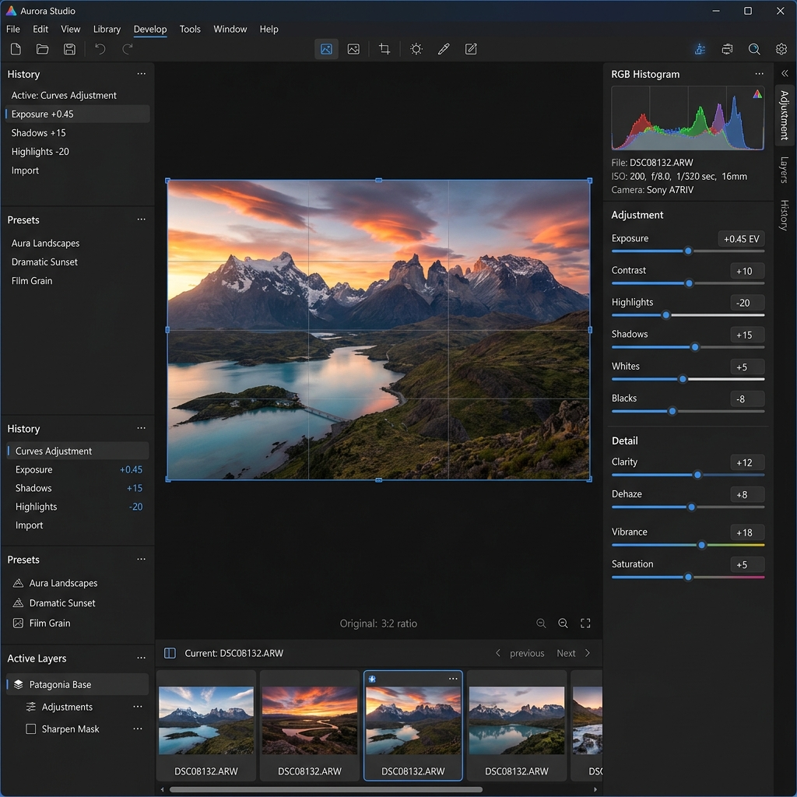
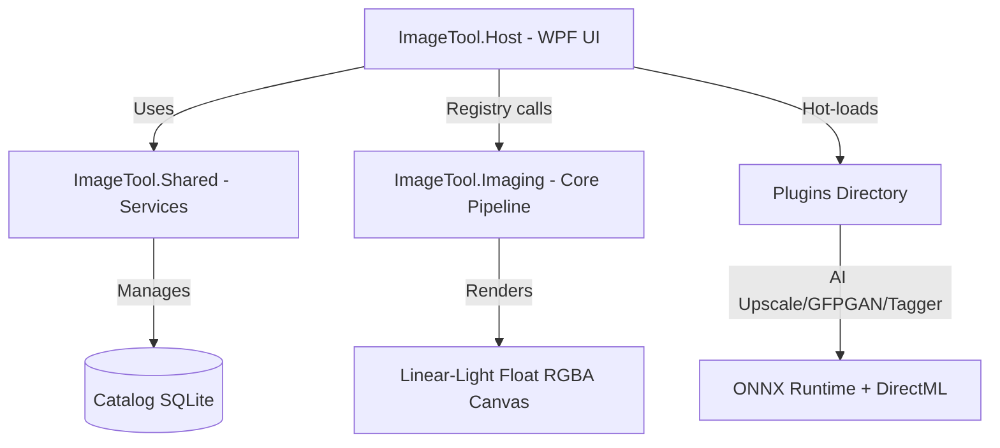

# Aurora Studio

[](https://github.com/kzxl/AIImageTool/actions/workflows/build-test.yml)
[](LICENSE)


> **Aurora Studio** is a modern desktop application (WPF, .NET 8) for image management, processing, and enhancement. It combines professional-grade **non-destructive editing** (similar to Adobe Lightroom / Darktable) with cutting-edge **AI tools** (super-resolution upscaling, face restoration, intelligent auto-tagging).

---



---

## Key Features

### 1. Non-Destructive Develop Pipeline (Linear Light)

All image adjustments are applied in **linear light float RGBA** color space through an intelligent pipeline, preserving maximum highlight/shadow detail without color banding.

#### Tone & Lighting
- **Exposure, Contrast, Highlights, Shadows, Whites, Blacks**
- **Tone Curve & Parametric Curve** with drag-point editing and built-in presets (*Linear, Medium, Strong, Faded*)
- **Filmic, Filmic RGB, Sigmoid, Tone Equalizer, Dehaze**
- **Levels** (per-channel editing, **Auto Levels**, **Auto Color** for color cast removal)
- Interactive **Histogram** with direct tone adjustment by dragging

#### Color
- **White Balance** (Kelvin slider, **Auto WB**, **eyedropper** tool, standard illuminant presets)
- **HSL 8-channel mixer** + **Targeted Adjustment Tool (TAT)** (click-drag directly on image for HSL adjustment)
- **Color Balance RGB 4-way** and **Color Grading** wheels
- **Split Toning, Channel Mixer, Selective Color, Color Unify, Velvia, Color Contrast (Lab)**
- **3D LUT (.cube)** support and input color profiles (**sRGB, AdobeRGB, Rec2020, Display P3**)
- **Black & White**: Deep channel mixing with classic color filters and toning
- **Film Negative (negadoctor)**: Professional film scan processing

#### Detail & Sharpness
- **Sharpen** (radius + intelligent edge **Masking**)
- **Noise Reduction** (Luminance, Color, Chroma)
- **Diffuse-or-sharpen (PDE)** filter, **Hot Pixel** removal, **CA Correct**, **Defringe**
- **Texture, Clarity, Grain** (monochrome and chromatic film grain)

#### Geometry & Layout
- **Crop** with free or standard aspect ratios (1:1, 16:9, 4:3...) and composition guide overlays
- **Straighten, Rotate, Flip** with EXIF-based auto-rotation
- **Perspective / Upright** correction, **Liquify/Warp** with intuitive handle-based editing
- **Lens Correction**: Automatic distortion and vignetting correction via **lensfun** database (EXIF-based) or manual adjustment

#### Local Adjustments
- Mask types: **Gradient, Radial, Brush, Polygon, Luminance & Color Range, Parametric, AI Subject & AI Sky**
- Combine multiple masks with opacity and blend modes
- Copy/duplicate masks easily; each mask has its own full set of adjustment sliders
- `O` key cycles **Mask Overlay Color** (Red/Green/Blue/White/Black) for better brush visibility

#### Presets & Style Management
- Save edits as **Styles** for batch application (selective module application)
- **Hover Preset Preview**: Hover over styles in the left panel for instant preview without affecting history
- **Import Lightroom presets (.xmp)**, auto-write XMP sidecar files
- **Named Snapshots**: Save multiple edit versions within the same image for quick comparison

---

### 2. Image Library & Smart Catalog

- Browse images via folder tree and thumbnail grid with scrolling filmstrip
- **Compare View**: Side-by-side Before/After (Y key) with **Link Zoom & Pan**
- Quick rating with **1-5 stars, Pick/Reject flags, Color Labels**. `B` key adds to **Quick Collection**
- High-performance **SQLite Catalog**:
  - Automatic image metadata storage
  - **Smart Collections**: Dynamic grouping by rules (e.g., all 50mm lens photos with rating >= 4 stars)
  - Advanced search by Camera, Lens, ISO, Aperture, Focal Length, Date
  - **Hierarchical Keywords** with suggestion dictionary
  - **Stacking**: Group similar or burst photos to reduce clutter

---

### 3. Integrated Info Panel

- **Real-time Histogram** (RGB/Luma) with clipping overlay warnings
- **Detailed EXIF**: Camera, Lens, Focal Length, Aperture, Shutter Speed, ISO
- **K-Means Color Palette**: Extract dominant colors (click to copy HEX code)
- **GPS Map**: Read coordinates and open directly on online maps
- Edit EXIF metadata directly (Description, Artist, Copyright, Make/Model...) and manage keyword tags

---

### 4. Professional Export Engine

- Export formats: **JPEG, PNG, WebP, TIFF** (8-bit or 16-bit high quality)
- Flexible resizing (by percentage or max edge length) with **Sharpen-for-output**
- Image or text **watermark**
- Smart filename tokens (`{name}_{date}_{n:000}`)
- Multi-threaded **batch export** without UI blocking
- Preserve or strip EXIF/GPS/IPTC metadata
- Silent overwrite prevention (auto-suffix to avoid data loss)

---

### 5. AI-Powered Plugins

The application supports dynamic plugin loading with safe isolation:

- **AssemblyLoadContext Isolation**: Each plugin loads in its own context with automatic dependency resolution via `.deps.json`, preventing DLL conflicts and enabling safe memory cleanup
- **AI Upscaler**: **4x-UltraSharpV2 (ONNX)** model with **Tiled Inference** (saves VRAM) running on DirectML GPU (NVIDIA, AMD, Intel) or CPU fallback
- **Face Restorer**: **GFPGAN (ONNX)** model for restoring blurry/damaged face details
- **Vision Tagger**: **WD ViT** model for automatic image content analysis and keyword tagging

---

### 6. Modern UI (v2026.07)

- **Custom Window Chrome**: Frameless window with title bar controls, drag-to-move, rounded corners, drop shadow
- **Dark/Light Themes**: Professionally designed palettes with high contrast and consistent styling
- **Drag & Drop**: Drop images or folders directly onto the application
- **Quick Export**: `Ctrl+Shift+E` for one-click export with current settings
- **Solo Mode**: `Alt+click` on any Develop group header to collapse all other groups
- **Toast Notifications**: Smooth fade-in/fade-out animations
- **Responsive Layout**: Resizable left/right panels with remembered widths

---

## System Architecture

The application follows a modular architecture separating UI from heavy image processing:



### Project Structure

| Project | Role / Technology |
| :--- | :--- |
| **`ImageTool.Core`** | Shared interfaces and models (Workspace, History, Catalog, Styles...) |
| **`ImageTool.Imaging`** | Non-destructive image processing core in **linear light float RGBA**. Manages ~40 edit operations (`IEditOp`), cached pipeline rendering (`CachedEditPipeline`) |
| **`ImageTool.Shared`** | Background services: SQLite Catalog (**LiteSql ORM**), History, Stacking, Batch Export, EXIF/GPS parser, filename token engine |
| **`ImageTool.Host`** | Main WPF UI layer (MVVM). Flexible view modes (Single, Grid, Cull, Compare), interactive histogram, smooth slider controls |
| **`Plugins`** | Independent AI modules (`FaceRestorer`, `Upscaler`, `VisionTagger`) loaded dynamically at startup |

---

## System Requirements

- **OS**: Windows 10 / 11 (64-bit)
- **Runtime (Lite build)**: [.NET 8 Desktop Runtime](https://dotnet.microsoft.com/download/dotnet/8.0)
- **Required**: [Visual C++ 2015-2022 Redistributable (x64)](https://aka.ms/vs/17/release/vc_redist.x64.exe) for native AI libraries
- **Recommended Hardware**: **DirectML**-compatible GPU (NVIDIA GeForce, AMD Radeon, Intel Arc/UHD Graphics) for AI model acceleration

---

## Installation & Running

Download the latest release from [Releases](../../releases):

- **Full Build (`AuroraStudio_Full_Win_x64.zip`)**: All dependencies and .NET Runtime bundled. Extract and run `AuroraStudio.exe`.
- **Lite Build (`AuroraStudio_Lite_Win_x64.zip`)**: Smaller package for machines with .NET 8 Runtime already installed.

---

## Keyboard Shortcuts

| Category | Shortcut | Action |
|----------|----------|--------|
| **Navigation** | `Left` / `Right` | Previous / Next image |
| | `E` / `G` / `C` / `F` | Single / Grid / Cull / Full view |
| | `Z` | Toggle zoom fit / 100% |
| | `+` / `-` | Zoom in / out |
| | `Space` + drag | Pan (hold Space) |
| **Comparison** | `Y` | Before/After side-by-side |
| | `\` (hold) | View original image |
| **Editing** | `D` | Switch to Develop tab |
| | `M` | Switch to Develop + focus masking |
| | `Ctrl+Z` / `Ctrl+Y` | Undo / Redo |
| | `Ctrl+Shift+C` / `V` | Copy / Paste develop settings |
| | `Ctrl+Shift+E` | Quick Export |
| **Crop** | `R` | Toggle crop mode |
| | `O` | Cycle crop guide overlay |
| | `Enter` / `Esc` | Apply / Cancel crop |
| | `[` / `]` | Rotate left / right |
| **Rating** | `0`-`5` | Star rating |
| | `P` / `X` / `U` | Pick / Reject / Unflag |
| | `6`-`9` | Color labels |
| | `B` | Toggle Quick Collection |
| **Clipping** | `J` | Toggle clipping warning |
| | `Alt` + drag slider | Preview clipping while adjusting |
| **Solo Mode** | `Alt` + click group | Collapse all other Develop groups |
| **Help** | `F1` / `?` | Toggle shortcut cheat sheet |

---

## For Developers

### Prerequisites
1. Install [.NET 8 SDK](https://dotnet.microsoft.com/download/dotnet/8.0)
2. Install Visual Studio 2022 or Rider with .NET 8 support
3. Install C++ compiler (for native module compilation)

### Build
```bash
# Build entire solution
dotnet build ImageTool.slnx -c Release

# Run unit tests (~800 automated tests)
dotnet test ImageTool.Tests/ImageTool.Tests.csproj
```

### Package & Release
The project includes a PowerShell script that builds, publishes, and zips both Lite and Full builds plus Plugins into the `Publish` directory:
```powershell
pwsh ./publish.ps1
```

### Writing Custom Edit Operators
See the developer guide at [WRITING_OPS.md](ImageTool.Imaging/WRITING_OPS.md) for instructions on creating new image processing operations.

---

## License

This project is licensed under the **Apache License 2.0**. See [LICENSE](LICENSE) for details.
