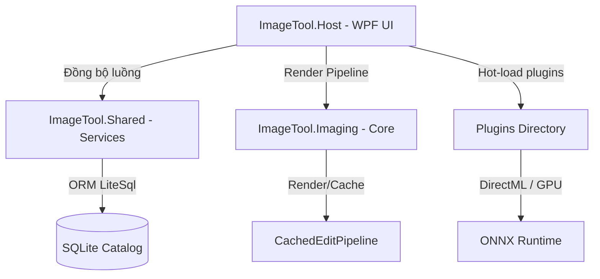
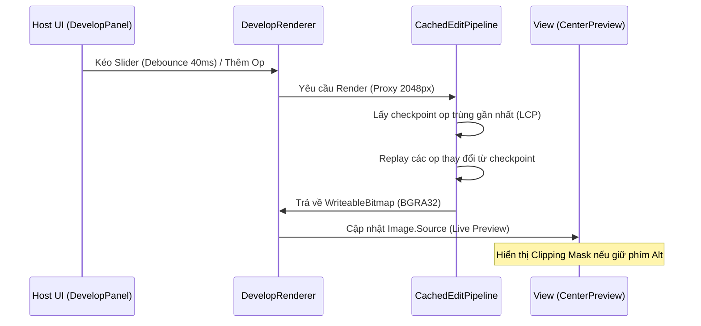

# 📘 Tài liệu Hệ thống & Lộ trình Phát triển (Roadmap) - Aurora Studio

Tài liệu này cung cấp cái nhìn toàn cảnh về kiến trúc hệ thống của **Aurora Studio** (WPF / .NET 8) và bản đồ lộ trình phát triển chi tiết để theo dõi tiến độ.

---

## 🏛️ 1. Kiến trúc Hệ thống (System Architecture)

Ứng dụng được thiết kế theo mô hình phân lớp module hóa cao, tách biệt giữa giao diện (UI) và lõi xử lý ảnh tuyến tính (Linear Light Pipeline):

### Các Project thành phần:
* **`ImageTool.Core`**: Định nghĩa các Interface, Model dùng chung (Workspace, History, Catalog, Styles...).
* **`ImageTool.Imaging`**: Lõi xử lý ảnh phi phá hủy (**non-destructive**) chạy hoàn toàn ở không gian màu tuyến tính (**linear light float RGBA**). Quản lý ~40 phép hiệu chỉnh ảnh (`IEditOp`) và pipeline render tối ưu (`CachedEditPipeline`).
* **`ImageTool.Shared`**: Chứa các dịch vụ nền: SQLite Catalog (sử dụng LiteSql ORM), History, Stacking, Batch Export, EXIF/GPS parser, và các thuật toán gom nhóm ảnh trùng.
* **`ImageTool.Host`**: Lớp giao diện người dùng chính (WPF, MVVM). Quản lý CenterPreview, DevelopPanel, Filmstrip, và liên kết các plugin AI.
* **`Plugins`**: Các module AI chạy độc lập (`Upscaler`, `FaceRestorer`, `VisionTagger`) được load động lúc khởi động.

---

## 🔄 2. Luồng Xử lý Ảnh Phi phá hủy (Rendering Pipeline)

---

## 📍 3. Trạng thái Hiện tại (Tính đến ngày 06/06/2026)

### Giao diện & Trải nghiệm (UI/UX) - **ĐÃ HOÀN THÀNH**
* [x] **Layout hiện đại**: Ghim Histogram và EXIF ở đầu cột phải, xếp chồng cột trái (Folder, History, Presets, Active Layers).
* [x] **Active Layers Panel**: Quản lý bật/tắt nhanh lớp mặt nạ bằng con mắt (👁/❌) và xóa mask từ cột trái.
* [x] **Modern Filmstrip**: Thumbnail bo góc tròn (`CornerRadius="6"`), viền highlight, hiển thị tên file.
* [x] **QoL - Alt-key Clipping Preview**: Giữ phím `Alt` khi kéo slider để xem trước vùng bị cháy sáng/mất chi tiết tối.
* [x] **Interactive Histogram**: Kéo trực tiếp trên biểu đồ để tăng giảm Exposure/Highlights/Shadows/Whites/Blacks.

### Lõi Xử lý Ảnh (Imaging Core) - **ĐÃ HOÀN THÀNH**
* [x] **~40 Edit Operations**: Đầy đủ White Balance (Kelvin/Eyedropper/Auto), Tone Curve (RGB/R/G/B presets), HSL 8 dải, Color Grading, Clarity, Dehaze, Levels, Local Masks (Gradient/Radial/Brush/Range/AI Subject/Sky).
* [x] **Hiệu năng**: Cache theo tầng (LCP check), xử lý đa luồng bất đồng bộ phi hồi đáp (`CancellationToken`), tối ưu SIMD cho WB & Exposure.

---

## 🗺️ 4. Lộ trình Phát triển Tiếp theo (Roadmap)

### 📌 Giai đoạn 1: Nâng cấp Hiệu năng & GPU (Hiệu suất cao)
* [ ] **GPU Compute Pipeline (15.1)**: Port các toán tử xử lý nặng (GaussianBlur, Dehaze, Clarity, Diffuse-sharpen) sang GPU sử dụng `ComputeSharp` hoặc `DirectML`.
* [ ] **Tối ưu hóa GC**: Sử dụng rộng rãi `ArrayPool` cho các buffer trung gian khi tính toán ma trận ảnh.

### 📌 Giai đoạn 2: RAW Demosaic & Quản lý Màu (Tối ưu hình ảnh)
* [ ] **LibRaw Native Integration (15.2)**: Tích hợp đầy đủ `libraw.dll` để demosaic trực tiếp dữ liệu RAW của các hãng (ARW, CR3, NEF) thay vì đọc JPEG preview nhúng.
* [ ] **Camera/Lens Profiles (15.3)**: Tích hợp đầy đủ database `lensfun` và đọc profile màu camera binary (DCP/DNG) để tự động sửa lỗi ống kính dựa trên EXIF.

### 📌 Giai đoạn 3: AI & Tính năng nâng cao
* [ ] **AI Segmentation Đa Lớp (15.5)**: Tải và tích hợp các model ONNX phân vùng đa đối tượng (Người, Da, Tóc, Bầu trời, Nền) để tạo mặt nạ thông minh 1-click.
* [ ] **Virtual Copies (15.9)**: Cho phép tạo nhiều phiên bản chỉnh sửa khác nhau của cùng một bức ảnh (virtual copies) hiển thị song song trên Grid View mà không nhân đôi file vật lý.
